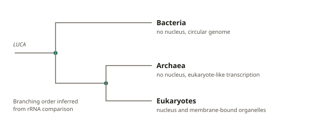
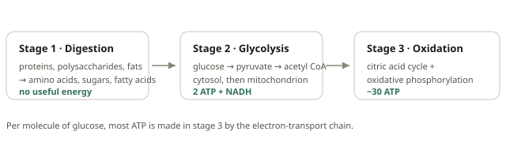

# Alberts Materials

Chapter write-ups and spaced-repetition cards for my reading of *Molecular Biology of the
Cell*. Live at **[alberts.liam-w.com](https://alberts.liam-w.com)**.

Everything is plain markdown. Write it in any editor and commit. There is no build step
and nothing to install.

> [!WARNING]
> **The code here is AI-generated. The material is not.**
>
> The site itself, meaning the HTML, CSS, Python and JavaScript, was written by an LLM and
> should be read with that in mind. Everything you actually study is mine: the chapter
> write-ups in `notes/`, the flashcards in `decks/`, and the paper summaries in `papers/`
> are written by hand, from my own reading.

## Current progress

Chapters in the order I'm working through them, not the book's own numbering, so that
everything is done before the Molecular Medicine master's at EMC starts. **Days** is a
rough time budget scaled to page count, not a deadline. The four checkbox columns track
separately because a chapter's write-up, deck, and summary rarely finish together.

| Ch | Pages | Days | Reading | Deck | Chapter Summary | Paper Summaries |
| --- | --- | --- | --- | --- | --- | --- |
| 1 | 49 | 1.5 | ✅ | ✅ | ⬜ | ⬜ |
| 2 | 66 | 2.0 | ⬜ | ⬜ | ⬜ | ⬜ |
| 3 | 68 | 2.0 | ⬜ | ⬜ | ⬜ | ⬜ |
| 5 | 68 | 2.0 | ⬜ | ⬜ | ⬜ | ⬜ |
| 6 | 76 | 2.5 | ⬜ | ⬜ | ⬜ | ⬜ |
| 10 | 34 | 1.0 | ⬜ | ⬜ | ⬜ | ⬜ |
| 12 | 66 | 2.0 | ⬜ | ⬜ | ⬜ | ⬜ |
| 17 | 62 | 2.0 | ⬜ | ⬜ | ⬜ | ⬜ |
| 14 | 62 | 2.0 | ⬜ | ⬜ | ⬜ | ⬜ |
| 13 | 62 | 2.0 | ⬜ | ⬜ | ⬜ | ⬜ |
| 15 | 76 | 2.5 | ⬜ | ⬜ | ⬜ | ⬜ |
| 7 | 78 | 2.5 | ⬜ | ⬜ | ⬜ | ⬜ |
| 16 | 78 | 2.5 | ⬜ | ⬜ | ⬜ | ⬜ |
| 22 | 34 | 1.0 | ⬜ | ⬜ | ⬜ | ⬜ |
| 4 | 70 | 2.0 | ⬜ | ⬜ | ⬜ | ⬜ |
| 8 | 88 | 3.0 | ⬜ | ⬜ | ⬜ | ⬜ |
| 9 | 40 | 1.5 | ⬜ | ⬜ | ⬜ | ⬜ |
| 11 | 46 | 1.5 | ⬜ | ⬜ | ⬜ | ⬜ |
| 18 | 16 | 0.5 | ⬜ | ⬜ | ⬜ | ⬜ |
| 19 | 58 | 2.0 | ⬜ | ⬜ | ⬜ | ⬜ |
| 20 | 54 | 1.5 | ⬜ | ⬜ | ⬜ | ⬜ |
| 21 | 62 | 2.0 | ⬜ | ⬜ | ⬜ | ⬜ |
| 23 | 40 | 1.5 | ⬜ | ⬜ | ⬜ | ⬜ |
| 24 | 51 | 1.5 | ⬜ | ⬜ | ⬜ | ⬜ |

## How it's organised

A **chapter** is two files that share a filename:

```
notes/ch01-cells-and-genomes.md     the write-up
decks/ch01-cells-and-genomes.md     the cards
```

Either half can be missing while you're partway through. A chapter with notes and no deck
still shows up and is readable; a chapter with a deck and no notes is still studyable. The
filename is the link between them, so the two must match exactly.

A **paper** is a third thing that sits alongside rather than inside a chapter:

```
papers/woese-1990-three-domains.md  the summary, plus what it's about
```

It's a standalone document: your summary of something you read. The front matter names
the chapters it belongs to, so one paper can surface under several of them, or under none
while you're still reading it. Its filename is yours to choose.

After adding or renaming any of these, or editing a paper's front matter:

```bash
$ python3 build-manifest.py
```

That rescans all three directories and rewrites `chapters.json`, pairing notes with decks
by name and lifting each paper's front matter into the index. Static hosting can't list a
directory, so `chapters.json` is how the site finds anything. Chapters are ordered by
filename, which is why they carry `ch01-`, `ch02-` prefixes.

If you forget to run it, the GitHub Action in
[`.github/workflows/manifest.yml`](.github/workflows/manifest.yml) is the safety net. It
waits for the Pages deploy of your push to finish, rebuilds `chapters.json`, and if that
changed anything it commits the fix and asks Pages for a fresh build. Delete that file if
you'd rather keep it manual.

## Writing a chapter write-up

A normal markdown post with front matter:

```markdown
---
title: Ch 3. Proteins
description: One line, shown on the chapter list and under the title.
date: 2026-08-10
tags: [mboc, ch3]
---

Opening paragraph, no heading needed.

## Shape is function

Use `##` for sections and `###` for subsections. Anything with three or more
sections gets a table of contents in the margin automatically.
```

`##` becomes a top-level section under the page title, and every heading gets an anchor so
the contents sidebar can link to it. Reading time is estimated from the word count.

Write-ups take the full markdown set: **bold**, *italic*, lists, `> quotes`, tables, links,
images, fenced code blocks, and LaTeX with `$…$` or `$$…$$`.

## Images

Put the file in `assets/img/` and reference it with a path from the **site root**, not from
the file you're writing in. This trips people up: the markdown lives in `notes/`, but the
page is served from `/`, so there is no `../`.

```markdown

```

When an image sits alone in its own paragraph, it renders as a figure and the alt text
becomes the caption underneath. Put the image inline in a sentence and it stays inline with
no caption, so the alt text is only read by screen readers.

The same syntax works inside a card, on either side:

```markdown
Q: In the diagram below, which stage produces the majority of the cell's ATP?



- [ ] Stage 1, digestion
- [x] Stage 3, oxidative phosphorylation
```

Both examples are live in the repo: the tree in
[`notes/ch01-cells-and-genomes.md`](notes/ch01-cells-and-genomes.md) and the card in
[`decks/ch02-cell-chemistry-and-bioenergetics.md`](decks/ch02-cell-chemistry-and-bioenergetics.md).

SVG is worth preferring for diagrams you draw yourself. It stays sharp at any size, weighs
almost nothing, and a `@media (prefers-color-scheme: dark)` block inside the file lets it
follow the site theme, which is what the two existing diagrams do.

## Writing cards

One deck file per chapter. Cards are separated by a line of `---`.

```markdown
---
title: Ch 3. Proteins
---

Q: What level of protein structure do α-helices belong to?
A: **Secondary** structure, meaning local folding stabilised by hydrogen
bonds along the polypeptide backbone.

---

Q: Which are true of the peptide bond?
- [x] It has partial double-bond character
- [x] It is planar
- [ ] It rotates freely
A: Optional explanation, shown once you've answered.
Tags: structure, bonds
```

### The three card types

| Type | How you write it | What happens |
|---|---|---|
| **Basic** | `Q:` … `A:` … | Front, then reveal the back |
| **Multiple choice** | `- [x]` correct, `- [ ]` wrong | Clickable options, graded immediately. More than one `[x]` makes it select-all. An `A:` becomes the explanation. |
| **Cloze** | `{{hidden text}}` in the question | Renders as a blank, filled in on reveal. Use `{{answer::hint}}` for a hint instead of `[ … ]`. |

`Q:`/`A:` can also be written `Question:`/`Answer:` or `Front:`/`Back:`. Both sides can run
to many lines. Everything up to the next `A:` is the front.

Cards accept the same markdown as write-ups, plus a `Tags: one, two` line anywhere in the
card.

## Papers

A paper is your summary of something you read, in `papers/`. The front matter is the
citation and the wiring; everything below it is yours.

```markdown
---
title: Towards a natural system of organisms
authors: Carl R. Woese, Otto Kandler, Mark L. Wheelis
year: 1990
journal: PNAS 87(12), 4576–4579
link: https://doi.org/10.1073/pnas.87.12.4576
chapters: [ch01-cells-and-genomes]
tags: [phylogenetics, archaea]
date: 2026-08-03
---

The paper that put the three domains on the map. Alberts states the conclusion in
a paragraph; this is the four pages of argument underneath it.

## The argument

Same markdown as a write-up, headings, contents sidebar and all.
```

`title` is the only field that matters. `chapters` is what makes it show up under
**Further reading** on those chapters' pages, and `ch01` is enough, because the build
script expands prefixes and warns if one matches nothing. Leave `chapters` off entirely
and the paper still lives in the library, marked *unlinked*.

Everything is browsable at [`#/papers`](https://alberts.liam-w.com/#/papers), searchable
by title, author, year or tag.

### Adding one without typing it out

```bash
$ python3 add-paper.py 10.1073/pnas.87.12.4576 -c ch01
$ python3 add-paper.py arXiv:2301.00001 -c ch03 -c ch07 -t methods
```

Looks the metadata up, using Crossref for DOIs and the arXiv API for preprints. Writes
`papers/<slug>.md` with the front matter filled in and the summary left blank, then
rebuilds the manifest. Standard library only, nothing to install. To land straight in your
editor:

```bash
$ $EDITOR "$(python3 add-paper.py 10.1038/191144a0 -c ch02 --quiet)"
```

No DOI? Pass the fields by hand with `--title`, `--authors`, `--year`, and it never
touches the network. `--help` lists the rest. Author lists are trimmed to the first eight
names, which `--all-authors` overrides.

### Citing a paper from a write-up or a card

`[[paper-slug]]` anywhere in a note or a card links to the summary, and renders as the
citation:

```markdown
Q: Why is ribosomal RNA the molecule of choice for building the tree of life?
A: It is present in every organism and changes slowly enough to stay alignable.
The argument is made properly in [[woese-1990-three-domains]].
```

That comes out as *Woese et al., 1990*. Use `[[slug|your own words]]` to write the label
yourself. A slug that doesn't match anything is left visible in amber rather than linking
nowhere, so typos are obvious.

Papers deliberately don't generate cards. A summary is its own thing; if reading one
teaches you something worth drilling, write that card in the chapter deck and cite the
paper from it.

## Studying

The scheduler is SM-2 with Anki-style learning steps. New cards appear at 1 and 10 minutes,
graduate to 1 day, then grow by an ease factor that moves with how you rate them. Each
rating button shows the interval it will actually give you.

| Key | Action |
|---|---|
| `Space` / `Enter` | Show answer, then rate as *Good* |
| `1` `2` `3` `4` | Again, Hard, Good, Easy |
| `A` to `Z`, or `1` to `9` | Pick a multiple-choice option |

Daily limits (20 new, 200 reviews) are adjustable in **Settings**, along with a shuffle
toggle. **Cram** replays a whole chapter without touching your scheduling.

## Progress and your data

Scheduling lives in this browser's `localStorage` under `alberts-srs-v1`. Nothing is sent
anywhere and there is no account. That also means progress doesn't follow you between
devices or survive clearing site data, so **Settings → Export progress** writes a JSON file
you can import elsewhere. Card identity is a hash of the question text, so editing an
answer or reordering a chapter keeps your scheduling. Rewording a question resets that one
card.

## Running it locally

```bash
$ python3 -m http.server 8000
```

Then open <http://localhost:8000>. It has to be served over HTTP rather than opened as a
`file://` path, because the content is loaded with `fetch`.

## How it's put together

```
index.html                  app shell
assets/css/style.css        all styling, light and dark
assets/js/markdown.js       markdown to HTML, with math/code/table/cloze/[[ref]] handling
assets/js/deck.js           deck file to cards
assets/js/papers.js         the paper library, and lazy loading of summaries
assets/js/srs.js            SM-2 scheduling and localStorage
assets/js/app.js            hash router and views
assets/img/*.svg            diagrams
notes/*.md                  chapter write-ups
decks/*.md                  chapter cards
papers/*.md                 paper summaries
chapters.json               generated index of all three
build-manifest.py           regenerates the above
add-paper.py                starts a paper summary from a DOI or arXiv ID
```

Routes are hash-based (`#/chapter/<slug>`, `#/cards/<slug>`, `#/study/<slug>`,
`#/papers`, `#/paper/<slug>`) so deep links work on GitHub Pages without server-side
rewrites.

Notes and decks are all loaded at startup; papers are not. Only their front matter travels
in `chapters.json`, and a summary is fetched when you open it, so the library can grow
without slowing the site down.

KaTeX and highlight.js load from jsDelivr and are the only external requests. Both are
optional. Without them math falls back to raw TeX and code blocks render unhighlighted, so
the site still works offline or if the CDN is blocked. To drop the network dependency,
download both into `assets/vendor/` and repoint the tags in `index.html`.

Deployment is GitHub Pages serving the branch directly, so pushing to `main` is the deploy.
`.nojekyll` is required: without it Jekyll would rewrite the markdown files and the site
would find nothing.
